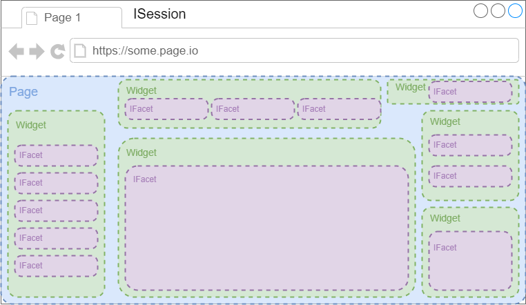

# AFT-UI
Automation Framework for Testing (AFT) package supporting UI testing using the Page Object Model (POM) to streamline UI test development and also supporting extension via plugins to support systems such as Selenium and Cypress.

*NOTE: support for Selenium, Cypress and any other frameworks are provided via their respective AFT packages*

## Page Object Model (POM)


the POM is a standard design pattern used in UI and layout testing. AFT-UI supports this model via a `Page` class that is made up of one or more `Widget` classes encapsulating logical blocks of functionality on the page. the `Widget` is then made up of one or more `IFacet` implementations. Take the following as an example of how one could interact with the following page https://the-internet.herokuapp.com/login

### Step 1: create the Page model class

```typescript
export class HerokuLoginPage extends Page {
    private content(): Promise<HerokuContentWidget> {
        return this.getWidget(HerokuContentWidget);
    }
    private messages(): Promise<HerokuMessagesWidget> {
        let wo: WidgetOptions = new WidgetOptions(this.container);
        wo.maxWaitMs = 20000;
        return this.getWidget(HerokuMessagesWidget, wo);
    }
    async navigateTo(): Promise<void> {
        await this.container.goTo('https://the-internet.herokuapp.com/login');
        return this.waitUntilDoneLoading();
    }
    async isDoneLoading(): Promise<boolean> {
        let hc: HerokuContentWidget = await this.content();
        return hc.isDoneLoading();
    }
    async login(username: string, password: string): Promise<void> {
        let hc: HerokuContentWidget = await this.content();
        return hc.login(username, password);
    }
    async hasMessage(): Promise<boolean> {
        let hm: HerokuMessagesWidget = await this.messages();
        return hm.hasMessage();
    }
    async getMessage(): Promise<string> {
        let hm: HerokuMessagesWidget = await this.messages();
        return hm.getMessage();
    }
}
```

### Step 2: create the Widgets

```typescript
export class HerokuContentWidget extends Widget {
    locator: FacetLocator = FacetLocator.id("content");

    private async usernameInput(): Promise<IFacet> {
        return this.findFirst(FacetLocator.id("username"));
    }
    private async passwordInput(): Promise<IFacet> {
        return this.findFirst(FacetLocator.id("password"));
    }
    private async loginButton(): Promise<IFacet> {
        return this.findFirst(FacetLocator.css("button.radius"));
    }
    async isDoneLoading(): Promise<boolean> {
        let ui: IFacet = await this.usernameInput();
        let pi: IFacet = await this.passwordInput();
        let lb: IFacet = await this.loginButton();
        let uiDisplayed: boolean = await ui.displayed();
        let piDisplayed: boolean = await pi.displayed();
        let lbDisplayed: boolean = await lb.displayed();
        return uiDisplayed && piDisplayed && lbDisplayed;
    }
    async login(username: string, password: string): Promise<void> {
        let ui: IFacet = await this.usernameInput();
        await ui.text(username);
        let pi: IFacet = await this.passwordInput();
        await pi.text(password);
        return this.clickSearchButton();
    }
    async clickSearchButton(): Promise<void> {
        let lb: IFacet = await this.loginButton();
        return lb.click();
    }
}
```
```typescript
export class HerokuMessagesWidget extends Widget {
    locator: FacetLocator = FacetLocator.id("flash-messages");

    private async message(): Promise<WebElement> {
        return this.findFirst(FacetLocator.id("flash"));
    }
    
    async isDoneLoading(): Promise<boolean> {
        return this.hasMessage();
    }

    async hasMessage(): Promise<boolean> {
        try {
            let el: IFacet = await this.message();
            return el !== undefined;
        } catch (e) {
            return false;
        }
    }

    async getMessage(): Promise<string> {
        let exists: boolean = await this.hasMessage();
        if (exists) {
            let el: IFacet = await this.message();
            return el.text();
        }
        return Promise.reject("no message could be found");
    }
}
```
### Step 3: use them to interact with the web application

```typescript
let session: ISession = await ISessionGenerator.get(); // creates new Browser session
let opts: WidgetOptions = new WidgetOptions(session);
let loginPage: HerokuLoginPage = new HerokuLoginBasePage(opts);
await loginPage.navigateTo(); // navigates to Heroku Login
await loginPage.login("tomsmith", "SuperSecretPassword!");
await Wait.forCondition(() => loginPage.hasMessage(), 20000);
let message: string = await loginPage.getMessage();
expect(message).toContain("You logged into a secure area!");
```

## Adding Plugins
plugins can be added to support frameworks such as Selenium and Cypress. Doing so involves a small amount of work to create the adapter layer, but afterwards should work identially between these different systems.

### Step 1: create an `ISessionGenerator` Plugin
the `ISession` is the system providing your UI session interface. In Selenium, this is the _WebDriver_. To create a new `ISession` implementation, first create the `ISessionGenerator` implementation which will return a new `ISession` implementation after calling the `ISession.initialise` method. See the below example on how to add support for using BrowserStack sessions:

```typescript
@ISessionGenerator.register
export class BrowserStackSessionGenerator implements ISessionGenerator {
    name: string = 'browserstack-session';
    async generate(options: SessionOptions): Promise<ISession> {
        let c: BrowserStackSession = new BrowserStackSession();
        await c.initialise(options);
        return c;
    }
}
```

### Step 2: create an `ISession` Implementation
the above `BrowserStackSessionGenerator` returns a `BrowserStackSession` referencing an active browser session. The code for this looks like:

```typescript
export class BrowserStackSession implements ISession, IDisposable {
    async initialise(options: SessionOptions): Promise<void> {
        if (options.driver) {
            this.driver = options.driver as selenium.WebDriver;
        } else {
            let caps: selenium.Capabilities = new selenium.Capabilities();
            caps.set('browserName', options.platform.browser);
            caps.set('browser_version', options.platform.browserVersion);
            caps.set('os', options.platform.os);
            caps.set('os_version', options.platform.osVersion);
            caps.set('resolution', options.resolution);
            caps.set('browserstack.user', '[get_from_configuration]');
            caps.set('browserstack.key', '[get_from_configuration]'); 
            let driver: selenium.WebDriver;
            try {
                driver = await new selenium.Builder()
                .usingServer(await BrowserStackConfig.hubUrl())
                .withCapabilities(caps)
                .build();
                let options: selenium.Options = await driver.manage();
                options.setTimeouts({implicit: 1000});
                await options.window().maximize();
            } catch (e) {
                return Promise.reject(e);
            }
            this.driver = driver;
        }
    }
    async dispose(e?: Error) {
        try {
            await this.driver.close();
            await this.driver.quit();
        } catch (e) {
            console.log(e);
        }
    }
    async find(locator: FacetLocator): Promise<IFacet[]> {
        try {
            let loc: selenium.By = this.getByForFacetLocator(locator);
            let elements: selenium.WebElement[] = await this.driver.findElements(loc);
            return await IFacetProvider.process(elements);
        } catch (e) {
            return Promise.reject(e);
        }
    }
    async goTo(url: string): Promise<void> {
        try {
            await this.driver.get(url);
        } catch (e) {
            return Promise.reject(e);
        }
    }
}
```

### Step 3: create an `IFacetProvider` Plugin
now that you have a way of starting and stopping Browser Sessions, you need an adapter to work with the elements on the page. This is provided by the `IFacetProvider` which must also be implemented and which must return an implementation of the `IFacet` interface.

```typescript
@IFacetProvider.register
export class SeleniumFacetProvider implements IFacetProvider {
    name: string = 'selenium-facet';
    async supports(element: any): Promise<boolean> {
        if (this.isWebElement(element)) {
            return true;
        }
        return false;
    }
    async provide(element: any): Promise<IFacet> {
        if (this.isWebElement(element)) {
            return new SeleniumFacet(element);
        }
        return Promise.reject('unsupported element type supplied to function');
    }
    private isWebElement(element: any): boolean {
        return element instanceof WebElement);
    }
}
```

### Step 4: create an `IFacet` implementation
the last step is to provide the `IFacet` implementation adapter for interacting with the elements on the page. This will look like the below:

```typescript
export class SeleniumFacet implements IFacet {
    root: WebElement;
    constructor(element: WebElement) {
        this.root = element;
    }
    async find(locator: FacetLocator, searchDuration?: number): Promise<IFacet[]> {
        let facets: IFacet[] = [];
        let loc: By = this.getByForFacetLocator(locator);
        if (!searchDuration) {
            searchDuration = 1000;
        }
        // get all elements matching locator under this root and return as IFacet[]
        await Wait.forCondition(async (): Promise<boolean> => {
            let elements: WebElement[] = await this.root.findElements(loc);
            facets = await IFacetProvider.process(...elements);
            return elements.length > 0 && facets.length == elements.length;
        }, searchDuration);
        return facets;
    }
    async enabled(): Promise<boolean> {
        return await this.root.isEnabled();
    }
    async displayed(): Promise<boolean> {
        return await this.root.isDisplayed();
    }
    async click(): Promise<void> {
        await this.root.click();
    }
    async text(input?: string): Promise<string> {
        if (input) {
            this.root.sendKeys(input);
            return this.root.getAttribute('value');
        }
        return await this.root.getText();
    }
    async attribute(key: string): Promise<string> {
        return await this.root.getAttribute(key);
    }
}
```